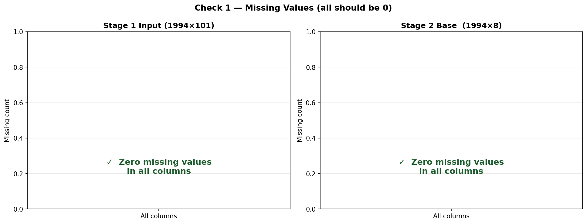
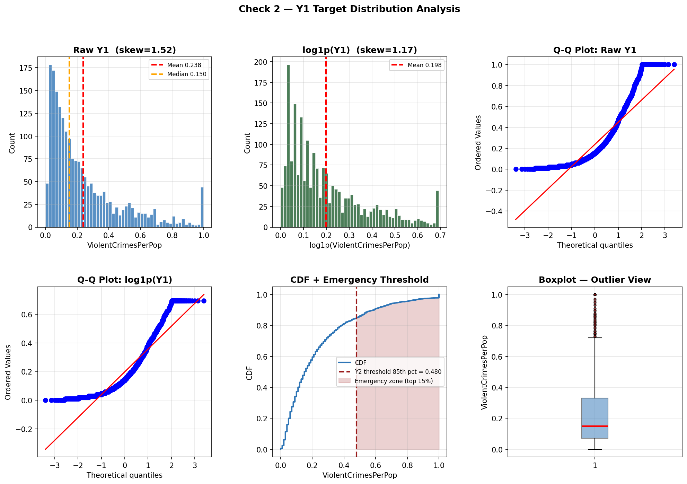
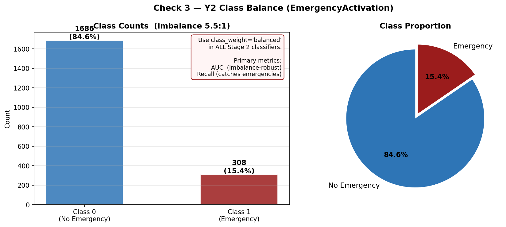
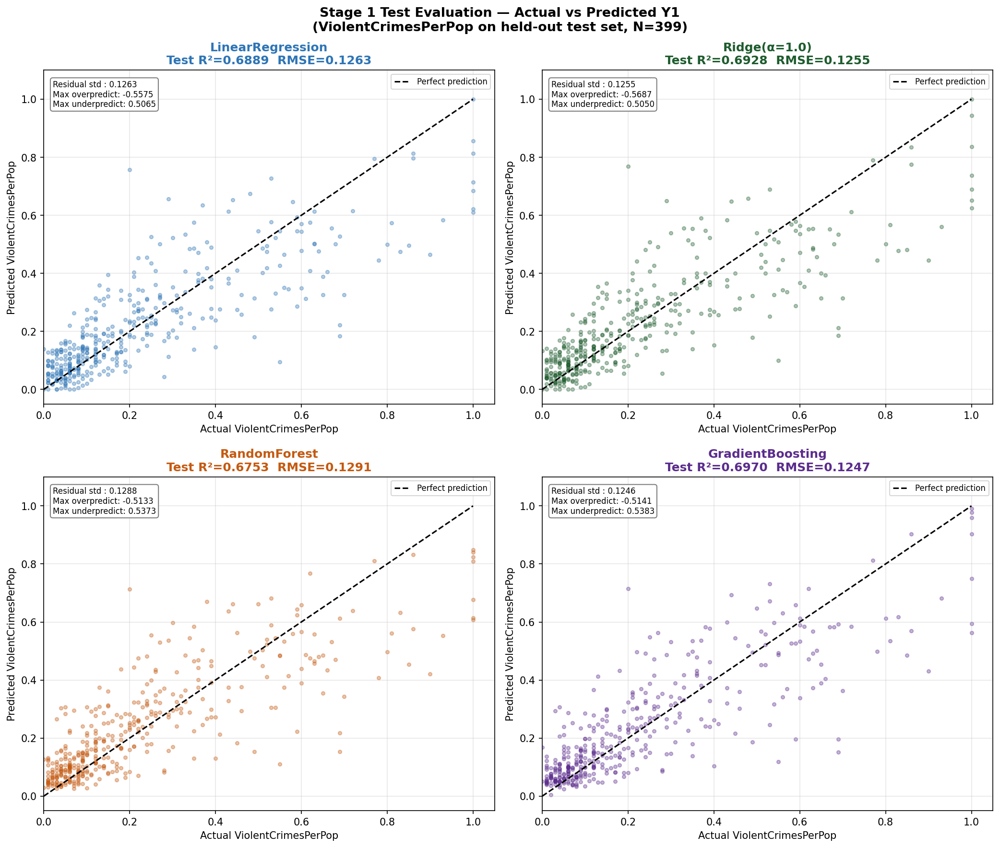
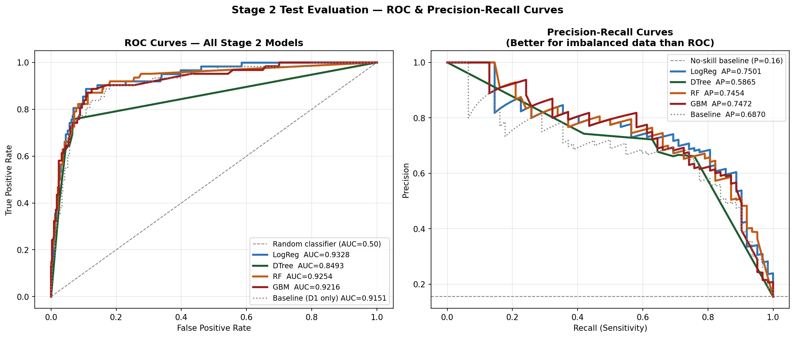
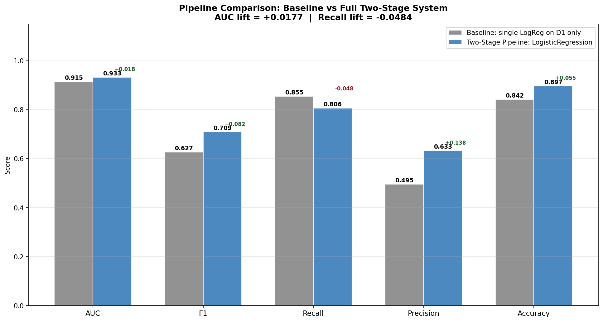
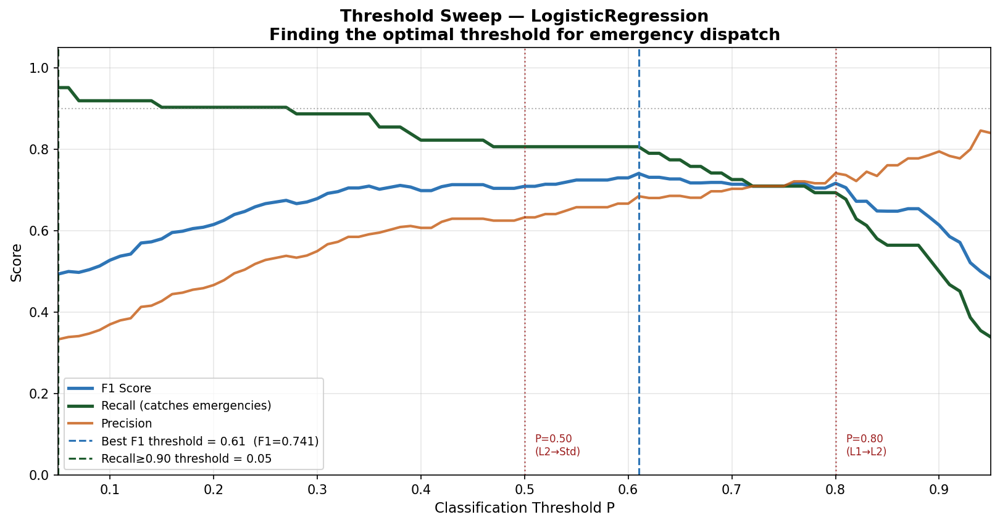
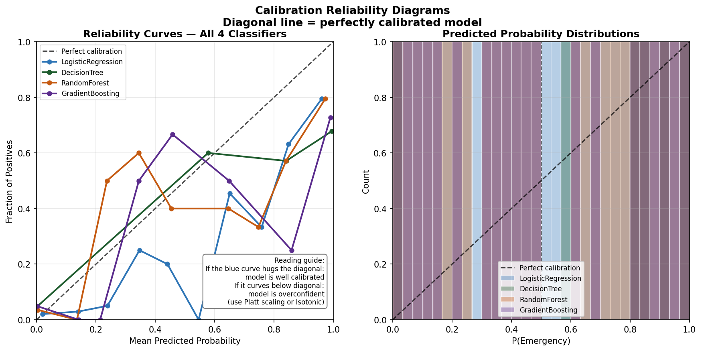
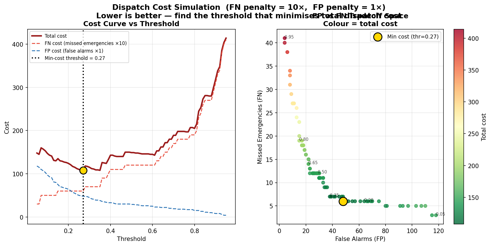

# P25 — Two-Stage Crime Risk Intensity and Emergency Dispatch Pipeline

Two-stage machine learning pipeline built on the UCI Communities and Crime dataset plus state-level crime context. The project predicts:

1. `Y1 = ViolentCrimesPerPop` with 4 competing Stage 1 regressors
2. `Y2 = EmergencyActivation` with 4 competing Stage 2 classifiers using state features plus all 4 Stage 1 predictions

The final business output is a dispatch tier table with `city`, `state`, and `dispatch_tier`.

## Project Summary

Stage 1 estimates community crime-risk intensity from demographic features.

Stage 2 uses:
- 7 state crime context features
- all 4 Stage 1 `Y1_hat` predictions

to estimate `P(EmergencyActivation)`.

That probability is then converted into:
- `Level-1: Full Deployment` for `P >= 0.80`
- `Level-2: Standby` for `0.50 <= P < 0.80`
- `Standard Patrol` for `P < 0.50`

## Datasets

| Dataset | Source | Rows | Features | Role |
|---|---|---:|---:|---|
| Communities and Crime | UCI ML Repository | 1,994 | 100 | Stage 1 community-level prediction |
| State Crime 1995 | CORGIS Project | 52 | 7 | Stage 2 state-level context |

Download links:
- D1: https://archive.ics.uci.edu/ml/machine-learning-databases/communities/
- D2: https://corgis-edu.github.io/corgis/datasets/state_crime/state_crime.csv

## Current Folder Structure

```text
ml_capstone_project/
├── data/
│   ├── raw/
│   │   ├── communities.data
│   │   ├── communities.names
│   │   └── state_crime.csv
│   └── processed/
│       ├── X1_train.npy
│       ├── X1_test.npy
│       ├── X2_train.npy
│       ├── X2_test.npy
│       ├── Y1_train_raw.npy
│       ├── Y1_train_log.npy
│       ├── Y1_test_raw.npy
│       ├── Y1_hat_train.npy
│       ├── Y1_hat_test.npy
│       ├── Y2_train.npy
│       ├── Y2_test.npy
│       ├── feature_names_S1.npy
│       ├── feature_names_S2.npy
│       ├── community_metadata_test.csv
│       ├── Y1_hat_test_with_metadata.csv
│       └── stage2_final_test_with_metadata.csv
├── outputs/
│   ├── eda/
│   ├── training/
│   ├── test/
│   ├── evaluation/
│   └── reports/
├── scripts/
│   ├── p25_eda.py
│   ├── p25_split.py
│   ├── p25_train1.py
│   ├── p25_train2.py
│   ├── p25_test.py
│   └── p25_evaluate.py
├── docs/
├── notebooks/
├── .gitignore
└── README.md
```

## Pipeline Flow

```text
communities.data
   -> p25_split.py
   -> Stage 1 train/test arrays

Stage 1: p25_train1.py
   LinearRegression
   Ridge
   RandomForestRegressor
   GradientBoostingRegressor
   -> save 4-column Y1_hat bridge

Stage 2: p25_train2.py
   [7 D2 features | 4 x Y1_hat] = 11 features
   LogisticRegression
   DecisionTree
   RandomForestClassifier
   GradientBoostingClassifier

Test Evaluation: p25_test.py
   -> compare all 4 Stage 1 models
   -> compare all 4 Stage 2 models
   -> select best Stage 1 by Test R²
   -> select best Stage 2 by Test AUC
   -> generate dispatch table for city/state/tier

Final Evaluation: p25_evaluate.py
   -> threshold sweep
   -> calibration analysis
   -> dispatch cost analysis
   -> final dispatch report
```

## Run Order

Run the scripts in this order:

```bash
python3 scripts/p25_eda.py
python3 scripts/p25_split.py
python3 scripts/p25_train1.py
python3 scripts/p25_train2.py
python3 scripts/p25_test.py
python3 scripts/p25_evaluate.py
```

## Output Layout

Generated artifacts are now split by purpose:

- `outputs/eda/`: EDA plots and summary
- `outputs/training/`: Stage 1 and Stage 2 training reports
- `outputs/test/`: held-out test plots
- `outputs/evaluation/`: threshold, calibration, and cost-analysis plots
- `outputs/reports/`: final reports and dispatch CSVs

## Training Outputs

Files written by training scripts:

- [p25_stage1_results.txt](/home/abhi-ubuntu-pc/Datascience,%20ML%20and%20DL/data_science/ml_capstone_project/outputs/training/p25_stage1_results.txt)
- [p25_stage2_results.txt](/home/abhi-ubuntu-pc/Datascience,%20ML%20and%20DL/data_science/ml_capstone_project/outputs/training/p25_stage2_results.txt)

These reports contain:

- Stage 1 cross-validated R² comparison across 4 regressors
- Stage 2 cross-validated AUC comparison across 4 classifiers
- explicit best-model selection during training

## EDA Outputs

Files written by `scripts/p25_eda.py`:

- [p25_eda_01_missing_values.png](/home/abhi-ubuntu-pc/Datascience,%20ML%20and%20DL/data_science/ml_capstone_project/outputs/eda/p25_eda_01_missing_values.png)
- [p25_eda_02_y1_distribution.png](/home/abhi-ubuntu-pc/Datascience,%20ML%20and%20DL/data_science/ml_capstone_project/outputs/eda/p25_eda_02_y1_distribution.png)
- [p25_eda_03_y2_class_balance.png](/home/abhi-ubuntu-pc/Datascience,%20ML%20and%20DL/data_science/ml_capstone_project/outputs/eda/p25_eda_03_y2_class_balance.png)
- [p25_eda_04_correlation_heatmap.png](/home/abhi-ubuntu-pc/Datascience,%20ML%20and%20DL/data_science/ml_capstone_project/outputs/eda/p25_eda_04_correlation_heatmap.png)
- [p25_eda_05_top_features_y1.png](/home/abhi-ubuntu-pc/Datascience,%20ML%20and%20DL/data_science/ml_capstone_project/outputs/eda/p25_eda_05_top_features_y1.png)
- [p25_eda_06_heteroscedasticity.png](/home/abhi-ubuntu-pc/Datascience,%20ML%20and%20DL/data_science/ml_capstone_project/outputs/eda/p25_eda_06_heteroscedasticity.png)
- [p25_eda_07_outliers_y1.png](/home/abhi-ubuntu-pc/Datascience,%20ML%20and%20DL/data_science/ml_capstone_project/outputs/eda/p25_eda_07_outliers_y1.png)
- [p25_eda_08_d2_features.png](/home/abhi-ubuntu-pc/Datascience,%20ML%20and%20DL/data_science/ml_capstone_project/outputs/eda/p25_eda_08_d2_features.png)
- [p25_eda_09_y1_by_y2_class.png](/home/abhi-ubuntu-pc/Datascience,%20ML%20and%20DL/data_science/ml_capstone_project/outputs/eda/p25_eda_09_y1_by_y2_class.png)
- [p25_eda_summary.txt](/home/abhi-ubuntu-pc/Datascience,%20ML%20and%20DL/data_science/ml_capstone_project/outputs/eda/p25_eda_summary.txt)

## Test Outputs

Files written by `scripts/p25_test.py`:

- [p25_test_stage1_scatter.png](/home/abhi-ubuntu-pc/Datascience,%20ML%20and%20DL/data_science/ml_capstone_project/outputs/test/p25_test_stage1_scatter.png)
- [p25_test_stage1_importance.png](/home/abhi-ubuntu-pc/Datascience,%20ML%20and%20DL/data_science/ml_capstone_project/outputs/test/p25_test_stage1_importance.png)
- [p25_test_stage2_confusion.png](/home/abhi-ubuntu-pc/Datascience,%20ML%20and%20DL/data_science/ml_capstone_project/outputs/test/p25_test_stage2_confusion.png)
- [p25_test_stage2_roc.png](/home/abhi-ubuntu-pc/Datascience,%20ML%20and%20DL/data_science/ml_capstone_project/outputs/test/p25_test_stage2_roc.png)
- [p25_test_pipeline_comparison.png](/home/abhi-ubuntu-pc/Datascience,%20ML%20and%20DL/data_science/ml_capstone_project/outputs/test/p25_test_pipeline_comparison.png)
- [p25_test_feature_importance_s2.png](/home/abhi-ubuntu-pc/Datascience,%20ML%20and%20DL/data_science/ml_capstone_project/outputs/test/p25_test_feature_importance_s2.png)
- [p25_test_report.txt](/home/abhi-ubuntu-pc/Datascience,%20ML%20and%20DL/data_science/ml_capstone_project/outputs/reports/p25_test_report.txt)
- [p25_test_dispatch_tiers.csv](/home/abhi-ubuntu-pc/Datascience,%20ML%20and%20DL/data_science/ml_capstone_project/outputs/reports/p25_test_dispatch_tiers.csv)

The test report now explicitly states:

- which Stage 1 model outperformed the other 3 on held-out Test R²
- which Stage 2 model outperformed the other 3 on held-out Test AUC
- that the final dispatch tier table is generated from the selected Stage 2 winner

## Evaluation Outputs

Files written by `scripts/p25_evaluate.py`:

- [p25_threshold_sweep.png](/home/abhi-ubuntu-pc/Datascience,%20ML%20and%20DL/data_science/ml_capstone_project/outputs/evaluation/p25_threshold_sweep.png)
- [p25_calibration.png](/home/abhi-ubuntu-pc/Datascience,%20ML%20and%20DL/data_science/ml_capstone_project/outputs/evaluation/p25_calibration.png)
- [p25_dispatch_cost.png](/home/abhi-ubuntu-pc/Datascience,%20ML%20and%20DL/data_science/ml_capstone_project/outputs/evaluation/p25_dispatch_cost.png)
- [p25_final_report.txt](/home/abhi-ubuntu-pc/Datascience,%20ML%20and%20DL/data_science/ml_capstone_project/outputs/reports/p25_final_report.txt)
- [p25_final_dispatch_tiers.csv](/home/abhi-ubuntu-pc/Datascience,%20ML%20and%20DL/data_science/ml_capstone_project/outputs/reports/p25_final_dispatch_tiers.csv)

The final report includes:

- Stage 1 winning model used for explanation
- Stage 2 winning model used for final dispatch output
- threshold analysis
- calibration and cost tradeoff interpretation
- final city/state/dispatch-tier table

## Graph Gallery

### EDA





### Test Evaluation





### Final Evaluation





## Key Design Decisions

| Decision | Reasoning |
|---|---|
| Two-stage design | State-level context can change dispatch urgency even when two communities have similar community-level crime intensity |
| Option B stacking | All 4 Stage 1 predictions are appended because disagreement between models can carry signal |
| Binary `Y2` with post-model tiers | Dispatch tiers are a business layer on top of probability output, not model classes |
| `log1p(Y1)` for linear models | Helps handle skew in `Y1`; tree models remain on raw scale |
| Balanced Stage 2 training | Addresses the strong class imbalance in emergency activation |

## Final Business Output

The main production-style output of this project is not just a metric. It is:

- a probability of emergency activation
- a selected dispatch tier
- a table of `city`, `state`, and `dispatch_tier`

This is saved in:

- `outputs/reports/p25_test_dispatch_tiers.csv`
- `outputs/reports/p25_final_dispatch_tiers.csv`

## Notes

- If you clear the `outputs/` folder and rerun the scripts, all plots and reports will be recreated in the new folder structure.
- `data/processed/` stores intermediate arrays and metadata files used across scripts.
